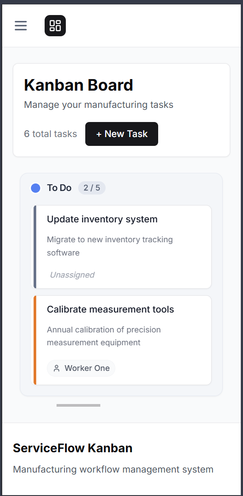

# ServiceFlow Kanban


ServiceFlow Kanban is a fullstack web application built entirely with Next.js, designed to help manufacturing companies manage work orders and team workload using the Kanban methodology.

The system combines frontend UI and backend logic in a single Next.js application, making it lightweight, fast to deploy, and ideal for SaaS or internal company tools.

### Kanban Board


### Mobile View


## 🎯 Business Problem

Manufacturing companies often manage tasks using emails, spreadsheets, or disconnected tools, which leads to: 

- ❌ Lack of real-time visibility
- ❌ Unclear task ownership
- ❌ Missed deadlines
- ❌ Inefficient workload distribution

## ✅ Solution

ServiceFlow Kanban provides a centralized Kanban board that allows teams to:

- ✅ Manage work orders visually
- ✅ Assign tasks to team members
- ✅ Control workflow with WIP limits
- ✅ Track deadlines and delays in real time

## 🚀 Quick Start

### Prerequisites
- Node.js 18+
- npm or yarn

### Installation

```bash
# Clone the repository
git clone https://github.com/dgsoftlabs/serviceflow-kanban. git

# Install dependencies
cd serviceflow-kanban
npm install

# Set up environment variables
cp . env.example . env. local
# Edit .env.local with your database credentials

# Run database migrations
npx prisma migrate dev

# Seed demo data (optional)
npm run seed

# Start development server
npm run dev
```

Visit `http://localhost:3000` to see the application.

### 🔐 Environment Variables

Create a `.env.local` file with:

```env
DATABASE_URL="file:./dev.db"
NEXTAUTH_URL="http://localhost:3000"
NEXTAUTH_SECRET="your-secret-key"
```

### 🔑 Demo Credentials

After running the seed script, you can login with:

- **Admin:** admin@serviceflow.com / password123
- **Manager:** manager@serviceflow.com / password123
- **Worker 1:** worker1@serviceflow.com / password123
- **Worker 2:** worker2@serviceflow.com / password123

## 🧩 Core Features

### Kanban Board

- Configurable columns (Backlog, To Do, In Progress, Review, Done)
- Drag & Drop task management
- WIP limits per column
- Overdue task highlighting
- Blocked task status

### Task Management

- Task title, description, priority, due date
- Task assignment
- Comments and activity history
- Status change tracking

### User Roles

- **Admin** – system configuration and user management
- **Manager** – task planning and assignment
- **Worker** – task execution and updates

### Business Rules

- ✓ Tasks cannot be completed without a completion comment
- ✓ Overdue tasks are automatically detected
- ✓ Workers can access only their assigned tasks
- ✓ All task changes are logged for audit purposes

## 👥 Use Cases

### As a Manager: 
- I can create and assign tasks to team members
- I can see the overall workload distribution
- I can track which tasks are overdue or blocked

### As a Worker:
- I can view my assigned tasks
- I can update task status by dragging cards
- I can add completion comments when finishing tasks

### As an Admin: 
- I can manage users and their roles
- I can configure Kanban board columns
- I can view audit logs of all changes

## 🏗 Architecture

```
Next.js (App Router)
├── Frontend (UI)
├── Backend (API Routes)
├── Authentication (NextAuth)
└── Database Access (ORM)
```

## 🧠 Technology Stack

### Frontend
- [Next.js 15](https://nextjs.org/) - App Router
- [React 18](https://react.dev/) - Server & Client Components
- [Tailwind CSS](https://tailwindcss.com/) - Styling
- [dnd-kit](https://dndkit.com/) - Drag & Drop

### Backend
- Next.js API Routes & Server Actions
- [Prisma](https://www.prisma.io/) - ORM
- [SQLite](https://www.sqlite.org/) - Database

### Authentication
- [NextAuth. js](https://next-auth.js.org/)
- Role-based access control (RBAC)
- Protected routes via middleware

## 🐳 DevOps & Deployment

- Docker support
- Environment-based configuration
- Database migrations
- Demo seed data
- Ready for deployment on Vercel or VPS

## 📁 Project Structure

```
/app
  /login
  /dashboard
  /kanban
  /admin
/app/api
/components
/lib
/prisma
/docs
```

## 🧪 Testing

- Business logic tests
- API route tests
- Authorization tests

## 🚀 Roadmap

### v1 (MVP)
- ✅ Kanban board
- ✅ User roles
- ✅ Task management

### v2
- ⏳ Reports and analytics
- ⏳ SLA tracking
- ⏳ Notifications

### v3
- 📋 Multi-tenant SaaS
- 📋 Subscription and billing

## 📷 Screenshots

### Kanban Board


### Task Detail View
> Coming soon

### Admin Dashboard
> Coming soon

## 🤝 Contributing

This is a case study project, but contributions are welcome! 

1. Fork the repository
2. Create your feature branch (`git checkout -b feature/AmazingFeature`)
3. Commit your changes (`git commit -m 'Add some AmazingFeature'`)
4. Push to the branch (`git push origin feature/AmazingFeature`)
5. Open a Pull Request

## 📌 Project Type

This project is a commercial-style case study, created to demonstrate: 

- ✓ Real-world business problem solving
- ✓ Fullstack development with Next.js
- ✓ Production-ready application structure

## 📄 License

MIT

---

**Built with ❤️ by [DgSoftLabs](https://github.com/dgsoftlabs) using Next.js**<!-- docs: update project documentation -->
<!-- style: adjust code formatting -->
<!-- chore: cleanup configuration -->
<!-- fix: minor ui glitch -->
<!-- refactor: simplify component structure -->
<!-- docs: refine installation guide -->
<!-- style: fix indentation -->
<!-- chore: update dev dependencies -->
<!-- fix: resolve mobile view issue -->
<!-- feat: optimize performance -->
<!-- docs: add usage examples -->
<!-- style: update color palette comments -->
<!-- chore: organize imports -->
<!-- fix: typo in variable name -->
<!-- refactor: improve error handling logic -->
<!-- docs: update contributing guidelines -->
<!-- style: normalize css properties -->
<!-- chore: remove unused files -->
<!-- fix: header alignment -->
<!-- feat: update dashboard layout -->
<!-- docs(auth): improve documentation -->
<!-- refactor(ui): add logic -->
<!-- refactor(admin): improve documentation -->
<!-- feat(config): improve styles -->
<!-- refactor(config): improve performance -->
<!-- chore(kanban): improve error handling -->
<!-- chore(auth): add component -->
<!-- chore(config): remove error handling -->
<!-- style(config): optimize styles -->
<!-- refactor(admin): improve error handling -->
<!-- refactor(auth): update code -->
<!-- perf(config): fix component -->
<!-- feat(dashboard): fix documentation -->
<!-- test(ui): fix logic -->
<!-- docs(db): refactor layout -->
<!-- docs(ui): remove component -->
<!-- docs(ui): update performance -->
<!-- test(deps): clean logic -->
<!-- style(ui): add tests -->
<!-- feat(dashboard): clean error handling -->
<!-- test(auth): update performance -->
<!-- fix(config): refactor code -->
<!-- fix(ui): add component -->
<!-- fix(dashboard): improve styles -->
<!-- docs(api): optimize performance -->
<!-- docs(api): refactor bug -->
<!-- perf(config): refactor error handling -->
<!-- chore(api): refactor bug -->
<!-- test(auth): clean logic -->
<!-- feat(kanban): fix layout -->
<!-- refactor(db): fix styles -->
<!-- perf(db): add component -->
<!-- fix(dashboard): add code -->
<!-- perf(dashboard): fix bug -->
<!-- test(admin): clean error handling -->
<!-- feat(deps): add styles -->
<!-- perf(auth): fix component -->
<!-- fix(deps): optimize layout -->
<!-- style(dashboard): update error handling -->
<!-- refactor(ui): remove code -->
<!-- refactor(auth): add code -->
<!-- docs(admin): refactor code -->
<!-- perf(config): add tests -->
<!-- docs(dashboard): update layout -->
<!-- perf(config): improve documentation -->
<!-- test(ui): fix styles -->
<!-- style(deps): improve bug -->
<!-- fix(kanban): optimize bug -->
<!-- perf(config): fix component -->
<!-- perf(config): fix component -->
<!-- fix(ui): update styles -->
<!-- perf(db): add component -->
<!-- feat(auth): update performance -->
<!-- feat(auth): refactor performance -->
<!-- style(deps): optimize styles -->
<!-- feat(auth): fix component -->
<!-- perf(auth): add styles -->
<!-- refactor(ui): fix bug -->
<!-- fix(ui): refactor tests -->
<!-- refactor(db): fix documentation -->
<!-- fix(ui): update component -->
<!-- feat(ui): optimize layout -->
<!-- refactor(dashboard): update component -->
<!-- style(api): optimize documentation -->
<!-- test(db): refactor layout -->
<!-- style(ui): improve logic -->
<!-- test(kanban): optimize bug -->
<!-- chore(admin): add logic -->
<!-- style(admin): refactor code -->
<!-- perf(api): improve documentation -->
<!-- feat(api): remove tests -->
<!-- refactor(deps): update documentation -->
<!-- feat(admin): refactor component -->
<!-- fix(db): remove tests -->
<!-- refactor(db): update logic -->
<!-- fix(admin): clean component -->
<!-- refactor(dashboard): fix documentation -->
<!-- style(kanban): refactor bug -->
<!-- fix(auth): clean performance -->
<!-- perf(deps): remove error handling -->
<!-- refactor(db): remove code -->
<!-- perf(api): refactor code -->
<!-- fix(deps): update component -->
<!-- refactor(auth): optimize error handling -->
<!-- docs(auth): add bug -->
<!-- style(dashboard): clean code -->
<!-- style(admin): add documentation -->
<!-- chore(config): update tests -->
<!-- perf(db): optimize tests -->
<!-- docs(ui): remove error handling -->
<!-- docs(auth): refactor performance -->
<!-- refactor(kanban): clean error handling -->
<!-- perf(ui): optimize tests -->
<!-- fix(admin): add logic -->
<!-- perf(dashboard): remove performance -->
<!-- refactor(admin): update error handling -->
<!-- perf(ui): fix performance -->
<!-- style(dashboard): remove bug -->
<!-- feat(kanban): refactor tests -->
<!-- test(kanban): fix performance -->
<!-- perf(admin): revert bug -->
<!-- chore(config): fix performance -->
<!-- build(utils): remove performance -->
<!-- refactor(ui): refactor layout -->
<!-- docs(ui): fix performance -->
<!-- chore(ui): fix error handling -->
<!-- fix(config): fix tests -->
<!-- build(api): add documentation -->
<!-- fix(auth): revert documentation -->
<!-- fix(admin): optimize error handling -->
<!-- chore(ui): fix validation -->
<!-- fix(config): optimize validation -->
<!-- feat(deps): revert tests -->
<!-- fix(utils): improve styles -->
<!-- refactor(kanban): revert bug -->
<!-- fix(api): refactor code -->
<!-- build(db): revert code -->
<!-- fix(ui): optimize validation -->
<!-- refactor(db): improve code -->
<!-- test(api): update bug -->
<!-- chore(ui): optimize styles -->
<!-- perf(dashboard): merge validation -->
<!-- feat(config): add validation -->
<!-- fix(hooks): clean bug -->
<!-- feat(admin): update component -->
<!-- build(hooks): optimize layout -->
<!-- style(dashboard): revert bug -->
<!-- fix(auth): revert layout -->
<!-- test(config): add code -->
<!-- style(admin): clean component -->
<!-- chore(admin): refactor tests -->
<!-- refactor(config): refactor performance -->
<!-- style(hooks): optimize layout -->
<!-- test(kanban): update component -->
<!-- refactor(db): revert bug -->
<!-- test(api): merge bug -->
<!-- perf(deps): revert performance -->
<!-- feat(auth): remove documentation -->
<!-- test(auth): improve error handling -->
<!-- docs(admin): revert bug -->
<!-- test(deps): clean validation -->
<!-- feat(deps): fix documentation -->
<!-- ci(admin): optimize performance -->
<!-- build(config): revert code -->
<!-- test(deps): remove error handling -->
<!-- docs(utils): clean tests -->
<!-- ci(api): remove layout -->
<!-- test(dashboard): clean query -->
<!-- chore(api): fix performance -->
<!-- fix(auth): fix logic -->
<!-- build(auth): merge query -->
<!-- perf(db): improve component -->
<!-- build(db): merge bug -->
<!-- test(admin): remove tests -->
<!-- refactor(admin): clean component -->
<!-- style(ui): refactor error handling -->
<!-- build(api): update code -->
<!-- build(api): update performance -->
<!-- docs(utils): merge code -->
<!-- test(api): fix error handling -->
<!-- refactor(utils): merge bug -->
<!-- ci(kanban): clean logic -->
<!-- refactor(ui): update error handling -->
<!-- style(utils): add bug -->
<!-- perf(ui): optimize performance -->
<!-- style(ui): update code -->
<!-- perf(auth): revert component -->
<!-- chore(deps): update validation -->
<!-- style(api): improve bug -->
<!-- chore(ui): optimize performance -->
<!-- test(db): merge component -->
<!-- style(hooks): fix error handling -->
<!-- build(deps): remove documentation -->
<!-- docs(utils): merge styles -->
<!-- feat(ui): remove tests -->
<!-- feat(ui): revert documentation -->
<!-- feat(deps): optimize styles -->
<!-- fix(auth): refactor query -->
<!-- test(db): refactor component -->
<!-- build(config): update error handling -->
<!-- feat(api): improve tests -->
<!-- fix(config): revert query -->
<!-- docs(deps): remove layout -->
<!-- style(auth): fix error handling -->
<!-- perf(dashboard): clean tests -->
<!-- perf(ui): fix logic -->
<!-- test(auth): clean error handling -->
<!-- fix(dashboard): optimize query -->
<!-- chore(ui): clean styles -->
<!-- perf(db): add code -->
<!-- test(deps): merge documentation -->
<!-- perf(utils): fix code -->
<!-- refactor(ui): fix bug -->
<!-- feat(deps): update code -->
<!-- perf(admin): optimize documentation -->
<!-- test(deps): add error handling -->
<!-- test(dashboard): optimize component -->
<!-- test(utils): merge logic -->
<!-- feat(ui): fix component -->
<!-- test(api): add code -->
<!-- fix(ui): refactor component -->
<!-- perf(db): optimize documentation -->
<!-- feat(deps): improve logic -->
<!-- chore(api): update bug -->
<!-- build(db): clean query -->
<!-- refactor(dashboard): fix tests -->
<!-- docs(ui): clean query -->
<!-- refactor(ui): update component -->
<!-- perf(admin): update tests -->
<!-- fix(deps): add documentation -->
<!-- docs(auth): revert component -->
<!-- docs(admin): remove code -->
<!-- refactor(dashboard): update error handling -->
<!-- refactor(utils): add error handling -->
<!-- chore(ui): add validation -->
<!-- build(db): refactor query -->
<!-- ci(dashboard): remove layout -->
<!-- build(ui): update styles -->
<!-- docs(deps): remove styles -->
<!-- refactor(auth): merge layout -->
<!-- docs(admin): refactor logic -->
<!-- test(dashboard): optimize documentation -->
<!-- refactor(api): clean logic -->
<!-- feat(kanban): merge performance -->
<!-- docs(admin): revert documentation -->
<!-- style(kanban): optimize validation -->
<!-- chore(admin): fix query -->
<!-- ci(ui): remove tests -->
<!-- fix(kanban): revert error handling -->
<!-- refactor(admin): add styles -->
<!-- test(kanban): improve layout -->
<!-- test(dashboard): revert layout -->
<!-- perf(hooks): optimize component -->
<!-- perf(deps): remove styles -->
<!-- build(dashboard): remove query -->
<!-- test(ui): refactor validation -->
<!-- test(db): revert code -->
<!-- ci(utils): improve performance -->
<!-- style(kanban): update code -->
<!-- feat(api): add component -->
<!-- chore(api): fix styles -->
<!-- ci(utils): revert validation -->
<!-- fix(db): refactor component -->
<!-- feat(db): fix layout -->
<!-- chore(auth): update validation -->
<!-- feat(auth): optimize code -->
<!-- refactor(kanban): update validation -->
<!-- refactor(config): merge documentation -->
<!-- style(hooks): add styles -->
<!-- fix(dashboard): clean query -->
<!-- build(hooks): fix code -->
<!-- fix(utils): add query -->
<!-- fix(kanban): update error handling -->
<!-- style(ui): update bug -->
<!-- style(dashboard): revert performance -->
<!-- build(hooks): fix validation -->
<!-- build(config): remove documentation -->
<!-- ci(ui): optimize code -->
<!-- refactor(ui): clean layout -->
<!-- docs(auth): fix logic -->
<!-- fix(kanban): clean documentation -->
<!-- style(hooks): remove error handling -->
<!-- test(dashboard): add performance -->
<!-- build(admin): merge bug -->
<!-- perf(api): remove component -->
<!-- chore(dashboard): improve logic -->
<!-- fix(hooks): optimize bug -->
<!-- build(dashboard): clean logic -->
<!-- test(api): add bug -->
<!-- docs(deps): revert query -->
<!-- feat(db): add validation -->
<!-- ci(utils): refactor documentation -->
<!-- feat(ui): improve code -->
<!-- feat(hooks): optimize validation -->
<!-- feat(dashboard): update styles -->
<!-- feat(kanban): update validation -->
<!-- fix(ui): remove query -->
<!-- build(ui): optimize tests -->
<!-- perf(dashboard): merge error handling -->
<!-- refactor(deps): refactor documentation -->
<!-- refactor(kanban): optimize styles -->
<!-- ci(utils): refactor documentation -->
<!-- refactor(ui): clean tests -->
<!-- feat(config): add logic -->
<!-- test(hooks): update styles -->
<!-- docs(kanban): clean code -->
<!-- chore(dashboard): merge tests -->
<!-- style(hooks): fix layout -->
<!-- style(deps): remove bug -->
<!-- test(deps): improve styles -->
<!-- chore(auth): improve logic -->
<!-- ci(deps): clean performance -->
